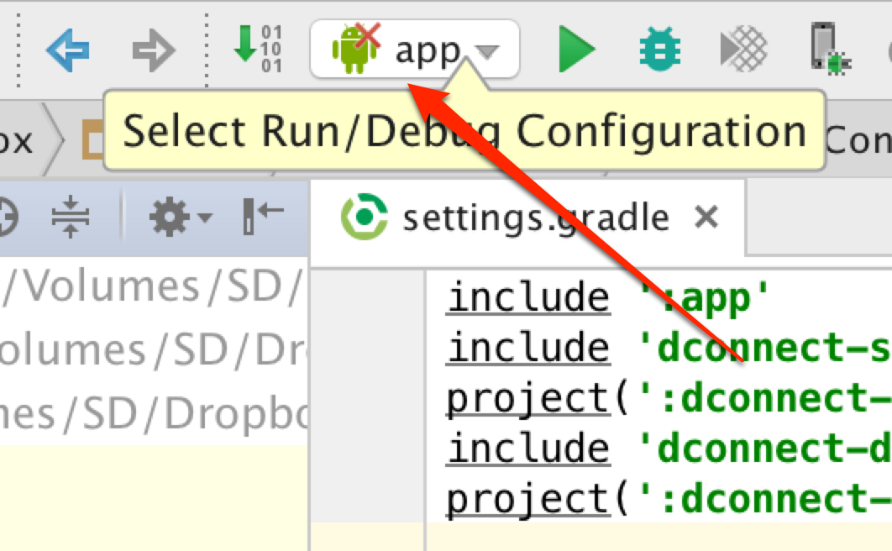

# プラグインについて

ここではAndroid向けにDeviceConnectのプラグインをインストールする方法を紹介します。

DeviceConnectのプラグインはDeviceConnect Managerの中で動作します。UIは特になく、デバイスとDeviceConnect Managerの間を仲介する役割になります。

今回は例えばPebble用プラグインをビルドします。

## Gitリポジトリの取得

最初にGitリポジトリを取得します。[Zipでダウンロード](https://github.com/DeviceConnect/DeviceConnect-Android/archive/master.zip)しても良いですし、 `git clone` でも良いです。

```
$ git clone https://github.com/DeviceConnect/DeviceConnect-Android.git
```

## Android Studioで開く

次にAndroid Studioで `DeviceConnect-Android/dConnectDevicePlugin/dConnectDevicePebble` を開きます。

環境によって、 Android SDK Platform 19などが必要になりますが、Android Studioがインストールしてくれるでしょう。


ライブラリのインストールが終わってAndroid Studioの画面が表示されると、上の方にあるAndroidアイコンのところにバツ印があるのが分かるかと思います。



この状態ではビルドできません。アイコンをクリックして、Edit Configurationsを選択します。

左側のメニューでAppを選ぶと、Launch OptionsのLaunchがDefault Activityになっているかと思います。


これをNothingにすると、ビルドできるようになります。


## プラグインをビルドする

プラグインをビルドするとAndroidのDeviceConnect Managerのプラグイン一覧の中にビルドしたプラグインが追加されているのが確認できるでしょう。これでDeviceConnectを通じてデバイスがコントロールできるようになります。


