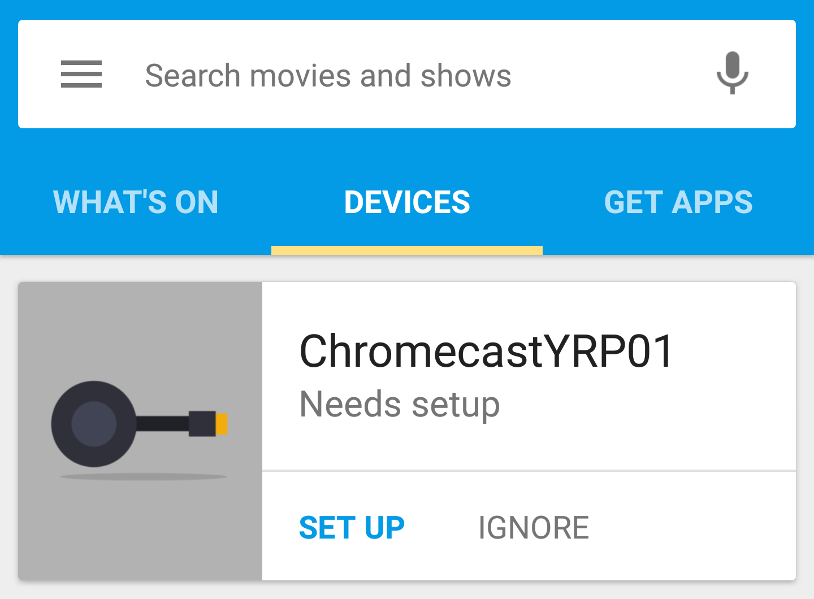
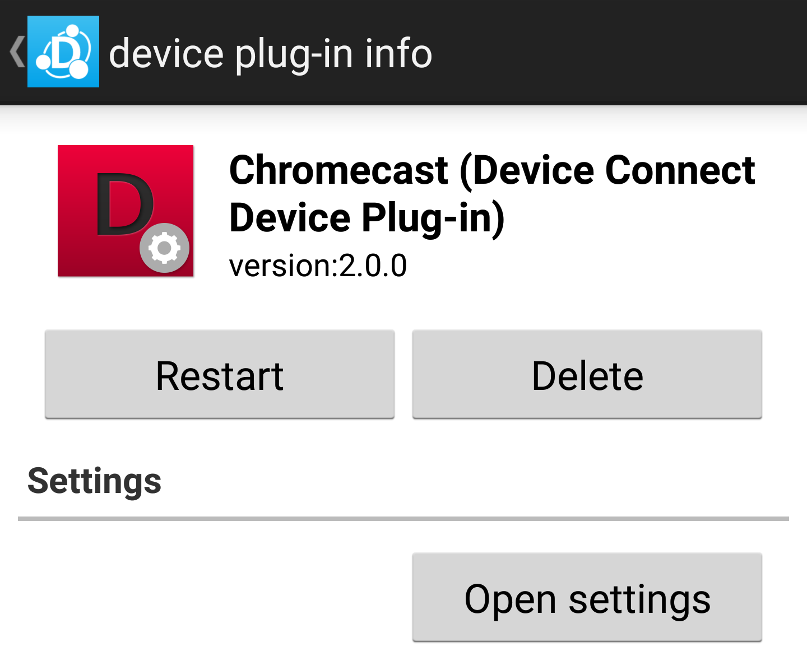

# Chromecastの使い方

ChromecastはGoogleが開発、販売しているデバイスでHDMIディスプレイに接続してスマートフォンの映像、写真を転送したり、専用アプリ（Hulu、Netflixなど）の映像を大きなディスプレイで見られるようになります。

## セットアップ

まずスマートフォンにChromecastアプリ（[Android](https://play.google.com/store/apps/details?id=com.google.android.apps.chromecast.app&hl=ja)）をインストールします。

インストールしたらアプリの説明に従ってChromecastのセットアップを行います。

最終的に同じWiFiネットワーク上にスマートフォンとChromecastが存在する状態になれば完了です。

## DeviceConnectプラグインのインストール

Chromecast用のDeviceConnectプラグインをビルドするか、[Androidであればビルドしたapkファイルを取得、インストール](https://github.com/DeviceConnectUsers/deviceconnectusers.github.io/releases/download/0.1/dConnectDeviceChromeCast.apk)してください。

## Chromecastプラグインがサポートしている機能

Chromecastプラグインがサポートしている機能は次の通りです。

- [Canvas](/webapi/canvas)
- [通知](/webapi/notification)
- [メディアプレイヤー](/webapi/mediaPlayer)

